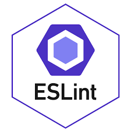

## Initial Setup: Easier Than Expected

Diving into the world of ESLint with IntelliJ, I was pleasantly surprised by how straightforward the setup was. This seamless beginning was a gentle introduction to a tool that promised to redefine my coding practices. It was a hint that perhaps, this journey would demystify the coding standards I'd heard so much about.

## The ESLint Effect: More Than Just Syntax

The real transformation began when ESLint became a part of my daily coding routine. It was like having a vigilant mentor over my shoulder, encouraging me to not only solve problems but to do so with elegance and foresight. The adoption of ESLint within my workflow catalyzed a shift in perspective towards writing code. It was no longer just about getting the functionality right; the structure and readability of my code took center stage. Each green checkmark became a nod to both the correctness and craftsmanship of my work. The emphasis on structure and readability made me more conscientious about my code, pushing me to ponder over my choices and their implications.

## A Lesson in Constancy: Discovering Immutability

One of the standout moments in this journey came from a simple ESLint rule: prefer `const` over `let` for unchanging variables. This rule, at first glance trivial, proved to be a masterclass in the value of immutability. It was an "aha" moment, where a piece of advice transformed into a deep understanding of how disciplined coding can lead to more stable and secure applications.

## Coding Standards: Constraints or Catalysts?

As my familiarity with ESLint grew, so did my appreciation for coding standards. Initially ambivalent, I've come to view these standards not as shackles but as liberating frameworks that guide creativity and innovation. They encourage not just compliance, but a deeper engagement with the craft of coding, balancing creativity with precision.

## From Compliance to Craftsmanship

Reflecting on my ESLint experience, I realize how much I've come to enjoy the pursuit of the green checkmark. What began as a quest for validation has evolved into a marker of personal and professional growth. ESLint has taught me that coding standards are less about enforcing rules and more about fostering excellence and mindfulness in programming. This journey has not only made me a better programmer but has deepened my love for the craft. The discipline of adhering to coding standards, far from being a burden, has become a cherished aspect of my development process, guiding me towards becoming not only a proficient coder but a thoughtful craftsman in the digital realm.

###### PS: ChatGPT helped in creating chatchy titles and with grammar, vocabulary and punctuation.
