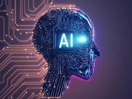

### I. Introduction

Artificial Intelligence (AI) has left its mark on various industries, education being a notable one. In software engineering, AI tools like ChatGPT, Bard, and Co-Pilot, though used sparingly in my coursework, provided an enhanced learning experience. This essay delves into how these tools occasionally influenced my understanding and application of software engineering principles during my course ICS 314 at the University of Hawaii.

### II. Personal Experience with AI

My engagement with AI tools in ICS 314 was selective yet impactful, helping clarify and expedite certain aspects of the course:

II. Personal Experience with AI
Throughout my course, ICS 314, my use of AI was selective and purposeful, applied strategically to enhance learning and understanding in specific areas:
1.	**Experience WODs (e.g., E18):** For WODs such as E18, I occasionally utilized ChatGPT to quickly generate basic code structures. This helped me get a running start on the problem, after which I personally refined and debugged the code to meet the specific requirements of the exercise.
2.	**In-class Practice WODs:** During practice sessions, I used AI sparingly for immediate suggestions and code examples when faced with complex problems. This assistance helped clarify advanced concepts but was always supplemented with personal research and understanding.
3.	**In-class WODs:** AI tools were used to provide supplementary information and explanations, especially when tackling new and complex topics. This helped in understanding the underlying principles before applying them in practical tasks.
4.	**Essays:** I used AI tools like Bard to help draft the structure of essays and provide suggestions on content organization. The real work of researching, writing, and ensuring the relevance and depth of content was performed manually.
5.	**Final project:** AI contributed by offering code optimization suggestions and debugging tips for my final project. This included minor syntax corrections and performance enhancements, which were critical during the project's development phase.
6.	**Learning a concept/tutorial:** AI tools provided additional explanations and examples when I encountered difficult concepts. This was particularly useful for reinforcing learning through varied explanations and viewpoints.
7.	**Answering a question in class or in Discord:** When quick information retrieval was necessary during discussions, AI tools helped provide accurate technical information, which I then verified through additional sources.
8.	**Asking or answering a smart-question:** In complex discussions, both in class and online, I used AI to help formulate well-structured questions and to provide detailed answers, which were often double-checked for accuracy.
9.	**Code examples and explanations:** During the development of a restaurant management system, I used AI to understand and implement certain functionalities. For instance, formatting business hours from data fetched dynamically required a nuanced understanding of JavaScript and libraries like `moment.js`:
   ```javascript
   const formatHours = (hours) => {
     return hours.map(hour => {
       const [start, end] = hour.split('-').map(time => moment(time, 'HH:mm').format('hh:mm A'));
       return `${start} - ${end}`;
     }).join(' - ');
   };
   ```
   This code snippet, enhanced by AI, illustrates the use of functional programming to handle time data effectively.

10.	**Explaining code:** AI was useful for explaining the functionality of complex code segments. For instance, it helped clarify the use of React and Meteor methodologies in web development projects, enhancing my understanding and ability to work with these frameworks.
11.	**Writing code:** AI suggestions were incorporated to start off writing scripts or functions, particularly when I was stuck on how to begin. This was followed by thorough personal revisions to ensure the code met all project requirements.
12.	**Documenting code:** I used AI to generate initial documentation comments, which I then expanded upon to ensure clarity and comprehensiveness for future reference or for other developers' use.
13.	**Quality assurance:** AI tools provided initial diagnostics for common errors and code smells, which I used as a starting point for deeper manual reviews and refinements.
14.	**Other uses in ICS 314 not listed above:** In some cases, AI was used to simulate user interactions and test user interface designs, providing quick feedback on usability and functionality that helped refine UI elements before actual user testing.


### III. Impact on Learning and Understanding

The selective use of AI tools in my software engineering education allowed me to appreciate their potential to simplify complex problems without becoming overly dependent on them. This approach helped reinforce my understanding of the fundamentals while benefiting from AI's capability to handle repetitive or standardized tasks efficiently.

### IV. Practical Applications

My practical application of AI extended to real-world software engineering tasks during the NSA Codebreakers challenge. In this context, AI tools were instrumental in analyzing cybersecurity threats and automating the assessment of potential vulnerabilities, thus enhancing our team's ability to address complex security challenges effectively.

### V. Challenges and Opportunities

The moderate use of AI in my coursework highlighted several challenges, such as ensuring the accuracy of AI-generated solutions and the risk of dependency. However, these challenges also present opportunities to integrate AI more thoughtfully into software engineering education, promoting a balanced approach that leverages AI's strengths while fostering deep, conceptual learning.

### VI. Comparative Analysis

Comparing traditional teaching methods with AI-enhanced learning, I found that traditional methods foster a deep, fundamental understanding through hands-on practice, whereas AI excels in providing quick solutions and insights. The most effective learning strategy, especially in a technical field like software engineering, likely involves a blend of both approaches.

### VII. Future Considerations

As AI continues to evolve, its integration into educational settings is expected to become more refined, offering more robust tools that enhance learning outcomes without overshadowing the need for critical thinking and fundamental skills.

### VIII. Conclusion

In conclusion, while my use of AI in ICS 314 was limited, it was undoubtedly transformative, offering insights and efficiencies that enhanced my educational experience. Moving forward, the thoughtful integration of AI into software engineering education will be crucial in developing skilled professionals capable of navigating an increasingly complex technological landscape.


<hr>

###### PS: ChatGPT helped in creating chatchy titles and with grammar, vocabulary and punctuation.
